<div align="center">
  <h1>📦 Smart Inventory Management System</h1>

  <blockquote>
    🎓 <b>Official Graduation Project</b><br>
    <b>Digital Egypt Pioneers Initiative (DEPI) – Cohort 4</b><br>
    <b>Cloud & DevOps Engineering Track</b>
  </blockquote>

  <p>
    <em>A Cloud-Native DevOps Graduation Project engineered with precision on Microsoft Azure.</em>
  </p>

  <!-- GitHub Badges -->
  <p>
    
    
    <a href="https://github.com/AbdelrahmanElbahnsy/DEPI-Smart-inventory-main/actions">
      
    </a>
    
    
    
    
    
    
    
    
    
    
  </p>

  <h3>🚀 Quick Access</h3>
  <table>
    <tr>
      <td align="center">🌐 <b>Live Demo</b></td>
      <td align="center">📂 <b>GitHub Repository</b></td>
    </tr>
    <tr>
      <td align="center"><a href="http://68.221.69.163">Access the Application</a></td>
      <td align="center"><a href="https://github.com/AbdelrahmanElbahnsy/DEPI-Smart-inventory-main">View Source Code</a></td>
    </tr>
  </table>
</div>

---

> **Note:** This repository hosts a **real, fully implemented graduation project**. It demonstrates end-to-end cloud-native engineering, utilizing a modern DevOps lifecycle to deliver a robust Microservices-based Inventory Management System.

<details>
<summary><b>📖 Table of Contents</b> (Click to expand)</summary>

- [Project Overview](#-project-overview)
- [Graduation Project](#-graduation-project)
- [Application Features & Dashboard](#-application-features--dashboard)
- [Project Highlights](#-project-highlights)
- [Architecture & Tech Stack](#-architecture--tech-stack)
- [System Workflow](#-system-workflow)
- [Deep Dive: Infrastructure & CI/CD](#-deep-dive-infrastructure--cicd)
  - [Infrastructure (Terraform & Ansible)](#infrastructure-terraform--ansible)
  - [Continuous Integration / Continuous Deployment (Jenkins)](#continuous-integration--continuous-deployment-jenkins)
- [Kubernetes (K3s) & Networking](#-kubernetes-k3s--networking)
  - [Kubernetes Resources Details](#kubernetes-resources-details)
- [Observability & Monitoring](#-observability--monitoring)
  - [Prometheus Targets & Metrics](#prometheus-targets--metrics)
  - [Alerting via Alertmanager](#alerting-via-alertmanager)
- [Security, High Availability, & Scalability](#-security-high-availability--scalability)
- [Project Structure](#-project-structure)
- [Installation & Quick Start](#-installation--quick-start)
- [API Reference](#-api-reference)
- [Live Demo](#-live-demo)
- [Future Improvements](#-future-improvements)
- [Author](#-author)

</details>

---

## 🌍 Project Overview

The **Smart Inventory Management System** is a sophisticated, highly resilient cloud-native application developed to solve the logistical challenges of modern inventory tracking. 

Built on a robust **Microservices Architecture**, the system intelligently decouples the frontend, backend APIs, and the database. Rather than relying on traditional monolithic servers, the entire application is containerized using **Docker** and orchestrated within a **K3s Kubernetes cluster** hosted on a **Microsoft Azure Ubuntu VM**. 

Traffic routing is handled efficiently utilizing **Traefik as the Kubernetes Ingress Controller**, while **Nginx** serves as a reverse proxy for specific static asset serving or legacy routing. This implementation achieves high availability, dynamic scalability, and provides deep observability through a meticulously configured **Prometheus and Grafana** stack.

---

## 🎓 Graduation Project

This project was developed as the official Graduation Project of the **Digital Egypt Pioneers Initiative (DEPI) – Cohort 4** under the **Cloud & DevOps Engineering Track**.

The objective of this project is to demonstrate the complete lifecycle of building, deploying, automating, securing, monitoring, and managing a production-ready cloud-native application using modern DevOps methodologies and Microsoft Azure.

This project covers:

- **Cloud Infrastructure**
- **Infrastructure as Code**
- **Configuration Management**
- **Docker Containerization**
- **Kubernetes Orchestration**
- **CI/CD Automation**
- **Monitoring & Alerting**
- **PostgreSQL Database**
- **Microservices Architecture**
- **Azure Deployment**

### 🎯 Project Objectives

- ✔️ **Build a Production-Ready Inventory Platform**
- ✔️ **Apply Cloud-Native Architecture**
- ✔️ **Automate Infrastructure using Terraform**
- ✔️ **Configure Servers using Ansible**
- ✔️ **Deploy Microservices with Kubernetes**
- ✔️ **Build CI/CD Pipelines using Jenkins**
- ✔️ **Monitor Infrastructure using Prometheus & Grafana**
- ✔️ **Implement Enterprise DevOps Best Practices**

> *"This repository represents the final graduation project submitted as part of the Digital Egypt Pioneers Initiative (DEPI) – Cohort 4, demonstrating practical implementation of modern Cloud Computing and DevOps Engineering concepts."*

---

## 📊 Application Features & Dashboard

The frontend is a high-performance SPA built with React.js, Vite, and TailwindCSS, providing a seamless user experience for managing enterprise resources.

<p align="center">
  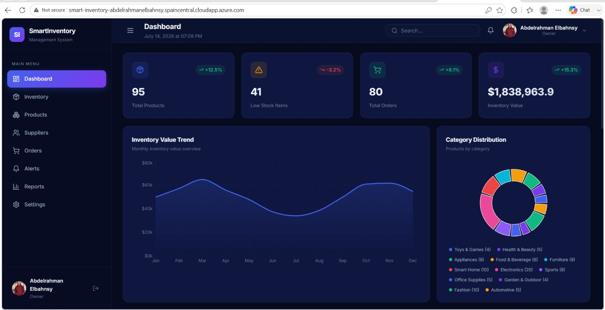
  <br>
  <em>Main Inventory Analytics Dashboard. Provides a high-level overview of stock levels, revenue, and alerts.</em>
</p>

### Orders & Stock Management

The platform allows administrators to track orders, manage supplier relationships, and update stock efficiently without latency.

<p align="center">
  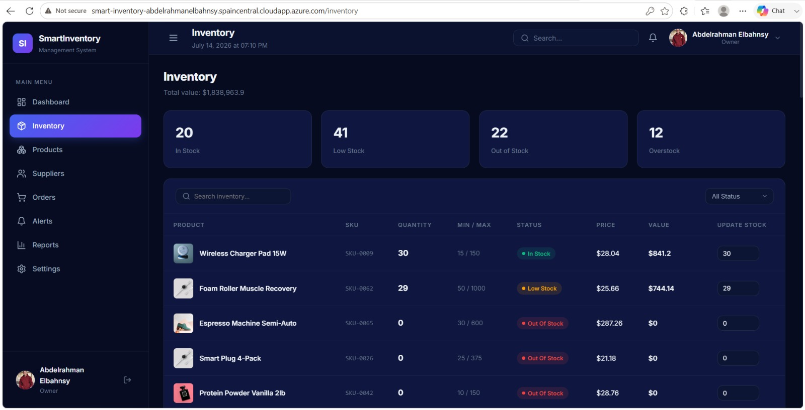
  <br>
  <em>Orders and Stock Management Interface. Seamless integration with backend microservices.</em>
</p>

---

## 🚀 Project Highlights

### Why This Project?
Traditional inventory systems struggle to scale efficiently under load and are notorious for single points of failure. This graduation project was initiated to bridge the gap between software development and enterprise-grade infrastructure operations (DevOps). The goal was to engineer a platform that could theoretically be dropped into a production environment with zero downtime deployments out of the box.

### Architecture Decisions
- **K3s over Standard K8s / AKS:** Chosen for its extremely lightweight footprint, K3s perfectly suits a robust single-node or edge deployment on an Azure VM while maintaining full Kubernetes API compatibility.
- **Traefik over Nginx Ingress:** Traefik natively integrates with Kubernetes CRDs and Docker, providing dynamic configuration updates without requiring pod restarts, which is a significant advantage over traditional Nginx ingress controllers.
- **Node.js + React:** Provides a rapid, non-blocking asynchronous environment (Node.js) paired with an optimized, component-driven frontend (React + Vite).

### Challenges & Solutions
- **Challenge:** Managing complex infrastructure state securely.
  - **Solution:** Implemented **Terraform** for declarative provisioning, securely storing the state locally and utilizing **Ansible** for idempotent configuration management of the bare-metal VM.
- **Challenge:** Blind spots in microservices performance.
  - **Solution:** Deployed the full **Prometheus** suite, utilizing `Node Exporter` for VM hardware metrics and `Postgres Exporter` for deep database observability, visualizing it all via **Grafana**.

---

## 🏗️ Architecture & Tech Stack

<p align="center">
  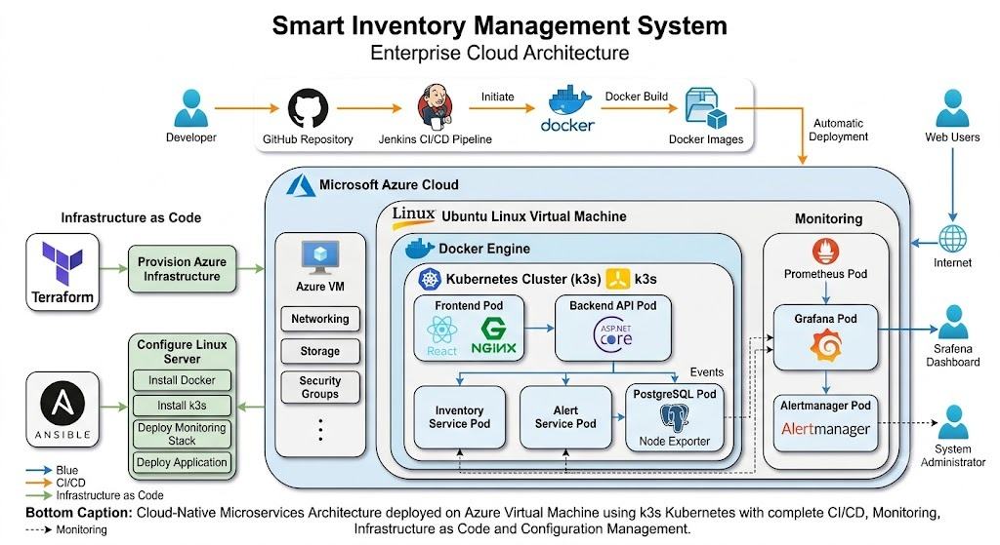
  <br>
  <em>High-level architectural diagram depicting the Microsoft Azure Infrastructure, Kubernetes boundaries, and traffic flow.</em>
</p>

### Core Technology Stack

| Domain | Technology | Implementation Details |
| :--- | :--- | :--- |
| **Frontend UI** | **React.js, Vite, TailwindCSS** | High-performance SPA with utility-first styling. |
| **Backend APIs** | **Node.js, Express.js** | Independent microservices (Inventory, Alerts, Core API). |
| **Database** | **PostgreSQL** | ACID-compliant relational data storage. |
| **Containerization**| **Docker** | Immutable images for every service and pipeline worker. |
| **Orchestration** | **K3s (Kubernetes)** | Lightweight, production-grade K8s distribution. |
| **Ingress** | **Traefik** | Dynamic Kubernetes Ingress Controller. |
| **Reverse Proxy** | **Nginx** | Supplementary reverse proxy routing. |
| **Provisioning** | **Terraform** | Azure VM, Network, and Security Group IaC. |
| **Configuration** | **Ansible** | OS hardening, Docker, and K3s cluster bootstrapping. |
| **CI/CD Pipeline**| **Jenkins** | Automated declarative pipelines (`Jenkinsfile`). |
| **Monitoring** | **Prometheus, Grafana** | Time-series metrics and interactive dashboards. |
| **Alerting** | **Alertmanager** | Anomaly detection and incident notification routing. |
| **Exporters** | **Node / Postgres Exporter**| Hardware and Database telemetry collection. |
| **Cloud Provider**| **Microsoft Azure** | Hosting the primary **Ubuntu Server VM**. |

---

## 🔄 System Workflow

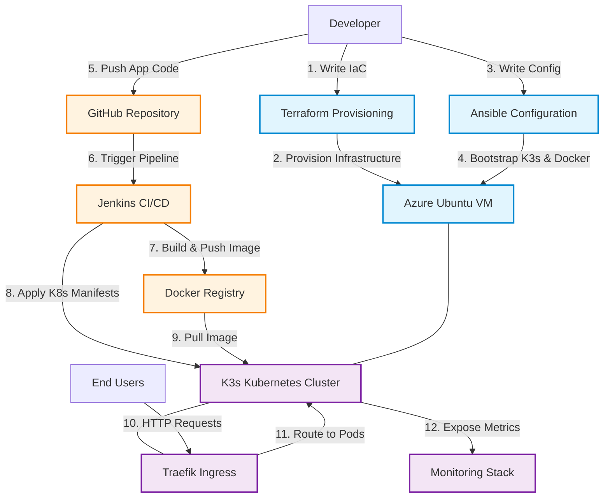

---

## ⚙️ Deep Dive: Infrastructure & CI/CD

### Infrastructure (Terraform & Ansible)
The project adheres strictly to the GitOps philosophy, where infrastructure is treated as software.

- **Terraform (`infra/terraform`):** Declarative configurations define the Microsoft Azure environment. This provisions the core Virtual Network (VNet), Network Security Groups (NSG) strictly limiting ingress traffic (e.g., ports 80, 443, 6443, 22), and the primary Ubuntu Server VM.
- **Ansible (`infra/ansible`):** Once Terraform completes, Ansible takes over via SSH. It executes idempotent playbooks to update system packages, enforce security baselines, install the Docker engine, and ultimately bootstrap the K3s cluster seamlessly.

### Continuous Integration / Continuous Deployment (Jenkins)
A robust declarative **Jenkinsfile** automates the entire software lifecycle.

<p align="center">
  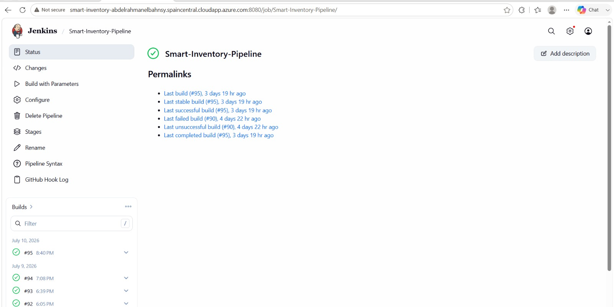
  <br>
  <em>Successful execution of the multi-stage declarative Jenkins pipeline.</em>
</p>

1. **SCM Checkout:** Pulls the latest code from GitHub.
2. **Build:** Compiles the React frontend via Vite and prepares Node.js backends.
3. **Docker Build:** Packages each microservice into immutable Docker images.
4. **Push:** Pushes the versioned images to the Docker registry.
5. **Deploy:** Executes `kubectl apply` to roll out the new manifests to the K3s cluster, ensuring zero-downtime rolling updates.

---

## ☸️ Kubernetes (K3s) & Networking

The application runs inside a CNCF-certified **K3s** cluster.

- **Manifests (`infra/k8s`):** Native Kubernetes YAML files define Deployments, ClusterIP Services, and ConfigMaps for the microservices (`frontend`, `inventory-api`, `alert-api`, `backend-api`).
- **Traefik Ingress (`05-ingress.yaml`):** The cluster utilizes **Traefik** as the Ingress Controller. It dynamically routes incoming HTTP traffic based on path prefixes (`/api/inventory`, `/api/alerts`, `/`) to the correct internal microservice pods, abstracting complex networking from the user.
- **Nginx Reverse Proxy:** Strategically implemented for supplementary reverse proxying tasks outside the core Traefik ingress paths.

<p align="center">
  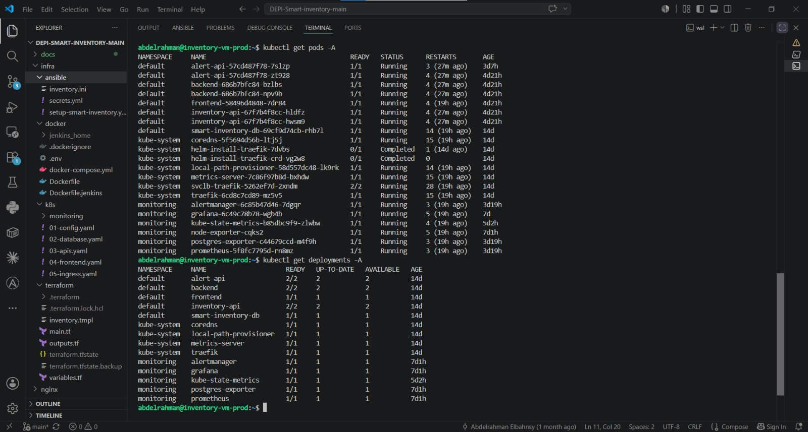
  <br>
  <em>K3s Pods actively running across multiple namespaces without CrashLoops.</em>
</p>

### Kubernetes Resources Details

The deployment relies heavily on strict separation of concerns utilizing Namespaces, ReplicaSets, and internal ClusterIP networking.

<p align="center">
  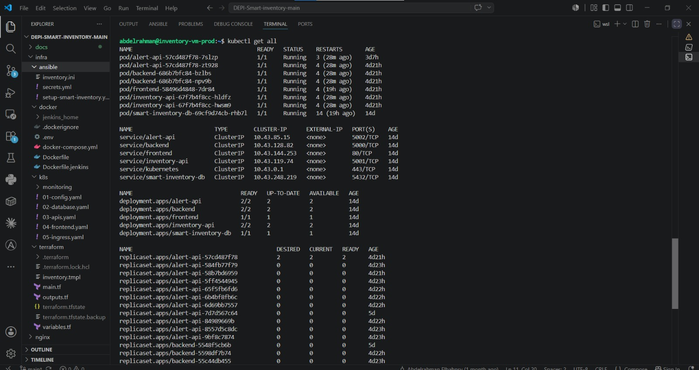
  <br>
  <em>Detailed view of active Kubernetes Services, Deployments, and ReplicaSets ensuring high availability.</em>
</p>

---

## 👁️ Observability & Monitoring

True cloud-native applications require deep observability. The system employs a full Prometheus stack, visualized through custom Grafana dashboards tailored for different infrastructure layers.

### 📈 Grafana Visualizations

- **Grafana:** Transforms raw Prometheus data into highly interactive, visual dashboards for real-time monitoring of cluster health, Nginx/Traefik ingress routing performance, and application throughput.

<p align="center">
  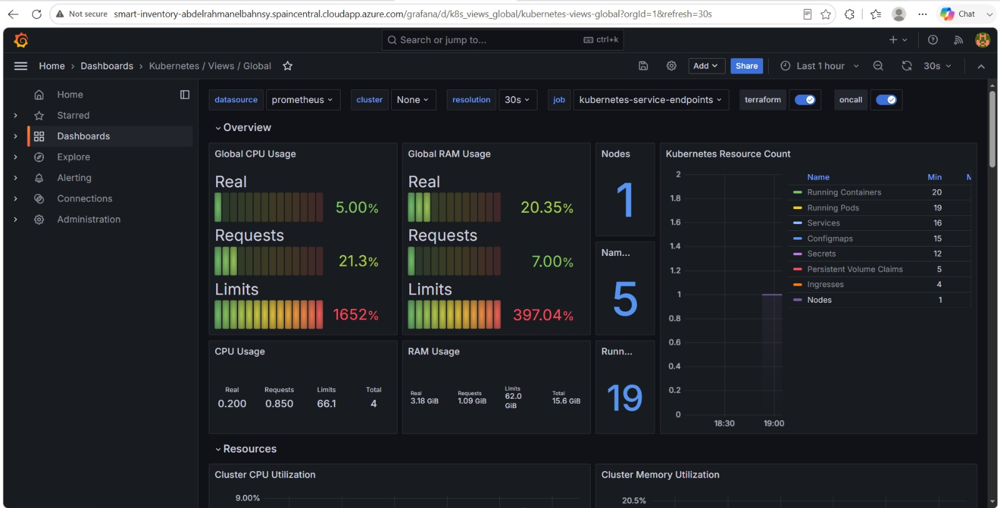
  <br>
  <em>Kubernetes Monitoring Dashboard: Comprehensive overview of K3s cluster health, pod CPU/Memory usage, and node capacity.</em>
</p>

<p align="center">
  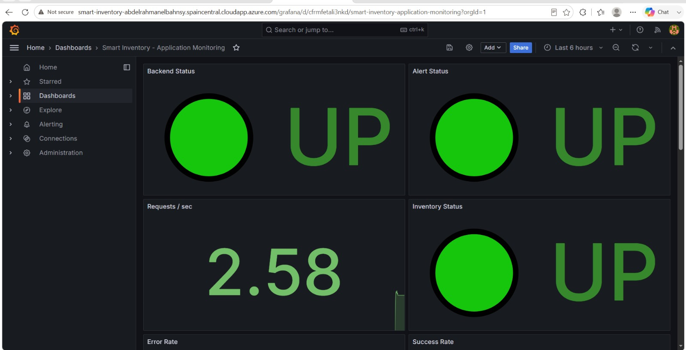
  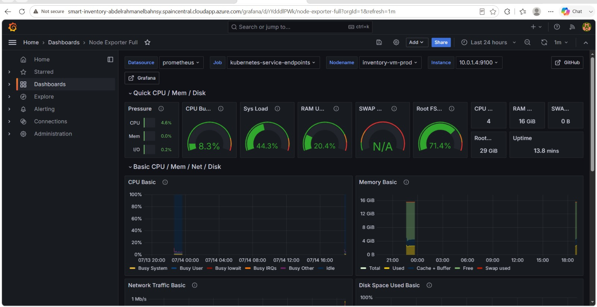
  <br>
  <em>Left: Business Metrics Dashboard detailing application-specific throughput. Right: Server Monitoring Dashboard analyzing raw Azure VM hardware telemetry.</em>
</p>

### Prometheus Targets & Metrics

- **Prometheus:** Scrapes time-series metrics from every pod, node, and service across the K3s cluster at 15-second intervals.
- **Node Exporter:** A daemon running on the Azure Ubuntu VM that feeds raw hardware telemetry (CPU wait times, memory saturation, network I/O) directly into Prometheus.
- **Postgres Exporter:** Connects directly to the PostgreSQL database to track connection pools, query latency, and cache hit ratios.

<p align="center">
  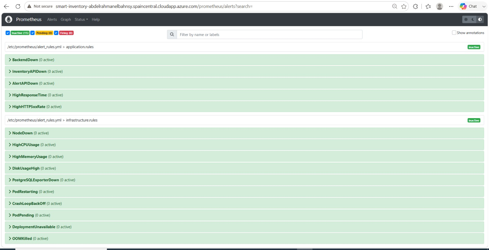
  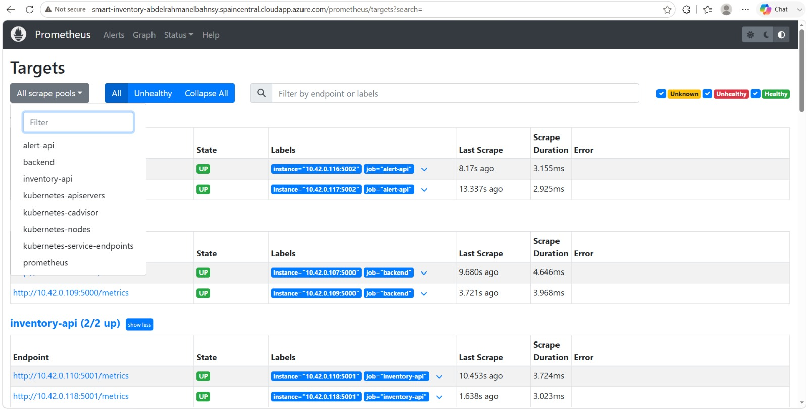
  <br>
  <em>Left: Querying raw time-series PromQL metrics. Right: Successfully registered and actively scraped Exporter targets.</em>
</p>

### Alerting via Alertmanager

- **Alertmanager:** Evaluates Prometheus alerting rules. If an anomaly is detected (e.g., node CPU > 90%, or a pod enters CrashLoopBackOff), it intercepts the alert and routes it to the designated incident management channel.

<p align="center">
  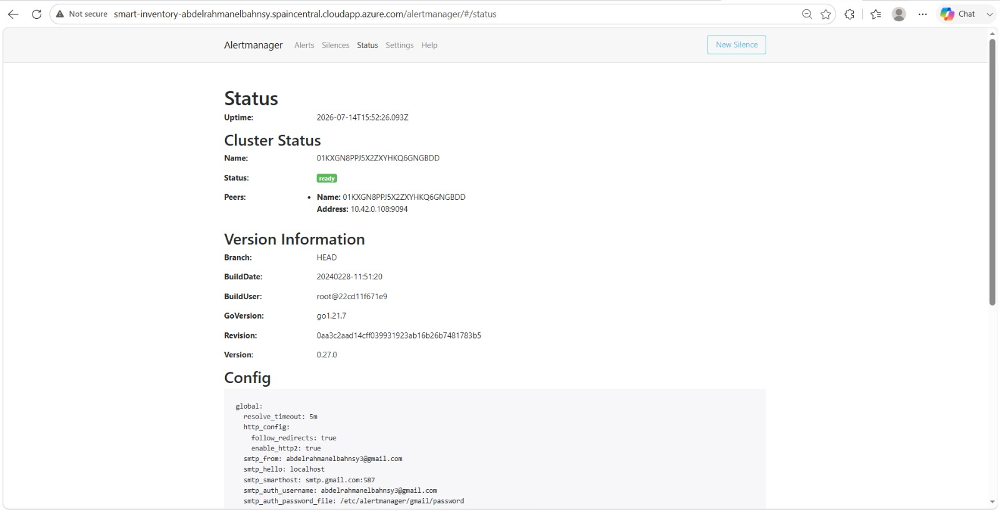
  <br>
  <em>Alertmanager actively monitoring cluster anomalies, deduplicating, and routing incident alerts.</em>
</p>

---

## 🛡️ Security, High Availability, & Scalability

- **Security Features:** Infrastructure is locked down via Azure NSGs. Inside the cluster, namespace isolation and Kubernetes Secrets ensure sensitive data (database passwords, API keys) is never exposed in plain text.
- **High Availability:** Kubernetes Deployments ensure that multiple identical replicas of core microservices are running simultaneously. If a pod crashes, K3s instantly detects the failure via Liveness Probes and spins up a replacement.
- **Scalability:** The architecture allows for Horizontal Pod Autoscaling (HPA). The Node.js microservices are completely stateless, allowing them to scale infinitely across worker nodes as HTTP traffic increases.

---

## 📂 Project Structure

This represents the exact directory structure of the repository, separating infrastructure from application code.

```text
DEPI-Smart-inventory-main/
├── docs/                     # Project documentation and screenshot gallery
├── infra/                    # Infrastructure as Code and Orchestration
│   ├── ansible/              # Playbooks for VM configuration and K3s bootstrapping
│   ├── docker/               # Docker Compose files (e.g., Jenkins server configuration)
│   ├── k8s/                  # Kubernetes Manifests
│   │   ├── 01-config.yaml    # ConfigMaps & Secrets
│   │   ├── 02-database.yaml  # PostgreSQL Deployment & Service
│   │   ├── 03-apis.yaml      # Node.js Microservices (Inventory, Alerts, Core)
│   │   ├── 04-frontend.yaml  # React Frontend Deployment
│   │   ├── 05-ingress.yaml   # Traefik Ingress routing rules
│   │   └── monitoring/       # Prometheus, Grafana, Alertmanager manifests
│   └── terraform/            # Azure IaC provisioning scripts
├── nginx/                    # Standalone Nginx reverse proxy configurations
├── services/                 # Microservices Source Code
│   ├── backend/              
│   │   ├── alert-api/        # Alert handling microservice
│   │   ├── api/              # Core API microservice
│   │   └── inventory-api/    # Inventory tracking microservice
│   ├── database/             # Database schemas and initialization scripts
│   └── frontend/             # React.js & Vite SPA source code
├── Jenkinsfile               # The core Jenkins CI/CD pipeline definition
├── docker-compose.yml        # Local development full-stack execution
└── README.md                 # This documentation file
```

---

## 💻 Installation & Quick Start

Follow these instructions to spin up the project on your local machine or deploy it to Azure.

### Prerequisites
- [Git](https://git-scm.com/)
- [Docker](https://www.docker.com/) & Docker Compose
- [Terraform](https://www.terraform.io/) (For cloud provisioning)
- [Ansible](https://www.ansible.com/) (For VM configuration)
- [kubectl](https://kubernetes.io/docs/tasks/tools/)

### 1. Clone the Repository
```bash
git clone https://github.com/AbdelrahmanElbahnsy/DEPI-Smart-inventory-main.git
cd DEPI-Smart-inventory-main
```

### 2. Local Environment (Docker Compose)
To run the entire stack locally without Kubernetes overhead:
```bash
docker-compose up --build -d
```
The application will be accessible locally via your browser.

### 3. Cloud Deployment (Terraform + Ansible)
Provision the Azure Infrastructure:
```bash
cd infra/terraform
terraform init
terraform apply -auto-approve
```
Configure the Server (Requires SSH access):
```bash
cd ../ansible
ansible-playbook -i inventory.ini site.yml
```

### 4. Deploy to Kubernetes
Once the K3s cluster is running, apply the manifests:
```bash
export KUBECONFIG=../kubeconfig.yaml
cd ../k8s

kubectl apply -f 01-config.yaml
kubectl apply -f 02-database.yaml
kubectl apply -f 03-apis.yaml
kubectl apply -f 04-frontend.yaml
kubectl apply -f 05-ingress.yaml
```

---

## 🔌 API Reference

The Traefik Ingress controller routes external requests to specific backend microservices based on the URL path.

| Ingress Path | Destination Service (Port) | Description |
| :--- | :--- | :--- |
| `/api/inventory` | `inventory-api` (5001) | Inventory tracking, stock updates, categorical queries. |
| `/api/alerts` | `alert-api` (5002) | System and business alert fetching and acknowledgement. |
| `/api` | `backend` (5000) | General backend requests, orders, and authentication. |
| `/` | `frontend` (80) | Serves the compiled React.js SPA static assets. |

---

## 🌐 Live Demo

The application is fully deployed on a highly available **Microsoft Azure Ubuntu VM** orchestrated by Kubernetes (K3s). You can access the live production environment and explore the real-time functionality through the following link:

👉 **[Access the Live Smart Inventory Application (http://68.221.69.163)](http://68.221.69.163)**

*(Note: If the application is inaccessible, the underlying Azure Virtual Machine may have been temporarily deallocated to conserve cloud credits for this graduation project).*

---

## 🔮 Future Improvements

While this graduation project implements a comprehensive DevOps lifecycle, further enterprise enhancements could include:
- **ArgoCD (GitOps):** Transitioning from the Jenkins push model to a pull-based GitOps workflow using ArgoCD to automatically synchronize cluster state with the GitHub repository.
- **Cert-Manager:** Implementing automated Let's Encrypt SSL/TLS certificate provisioning to secure Traefik ingress routes over HTTPS.
- **Helm Charts:** Refactoring raw Kubernetes YAML manifests into parameterizable Helm Charts for easier multi-environment deployments.
- **Elasticsearch (ELK Stack):** Centralizing container application logs using Elasticsearch, Fluentd/Logstash, and Kibana for deep log querying.

---

## 👨‍💻 Author

**Abdelrahman Mohamed El-Bahnsy**  
*Cloud | DevOps | Systems Engineer*

🎓 **Official Graduation Project**  
*Digital Egypt Pioneers Initiative (DEPI) – Cohort 4*  
*Cloud & DevOps Engineering Track*

### 🌐 Connect with Me

- [](https://github.com/AbdelrahmanElbahnsy)
- [](https://www.linkedin.com/in/abdelrahmanelbahnsy)

### 💬 About the Author

Passionate Cloud & DevOps Engineer with hands-on experience in Microsoft Azure, Docker, Kubernetes (K3s), Jenkins, Terraform, Ansible, Prometheus, Grafana, PostgreSQL, and modern DevOps practices.

This repository showcases the practical implementation of cloud-native architecture, CI/CD automation, Infrastructure as Code, configuration management, monitoring, and container orchestration through a production-ready Smart Inventory Management System.

---
<div align="center">
  <sub>Engineered with precision ❤️ utilizing modern Cloud Native technologies.</sub>
</div>
